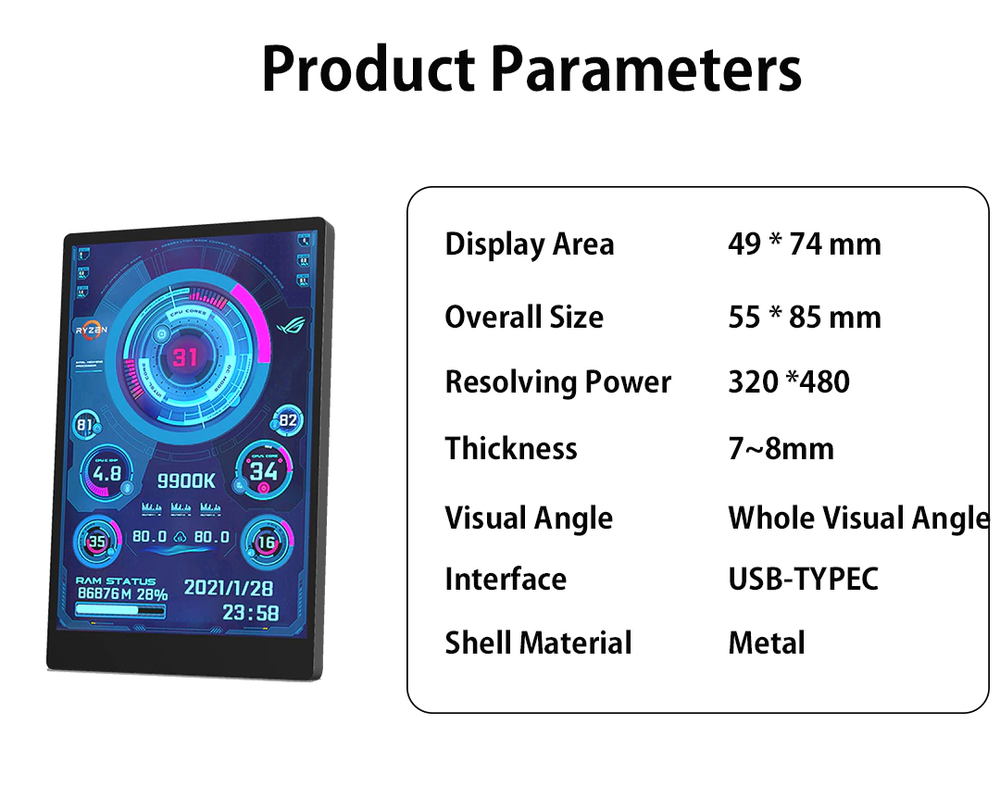

# turing-smart-screen-python

---
**⚠️ DISCLAIMER - PLEASE READ ⚠️**

This project is **not affiliated, associated, authorized, endorsed by, or in any way officially connected with Turing brand**, or any of its subsidiaries, affiliates, manufacturers or sellers of the Turing products. All product and company names are the registered trademarks of their original owners.

This project is an open-source alternative software, not the USBMonitor.exe original software for the Turing smart screen. There will be no support for the USBMonitor.exe software.

---

A simple Python manager for "Turing Smart Screen" 3.5" IPS USB-C (UART) display, also known as :
- Turing USB35INCHIPS / USB35INCHIPSV2
- 3.5 Inch Mini Screen
- [3.5 Inch 320*480 Mini Capacitive Touch Screen IPS Module](https://www.aliexpress.com/item/1005002505149293.html)

Operating systems supported : macOS, Windows, Linux (incl. Raspberry Pi) and all OS that support Python3
  

This is a 3.5" USB-C display that shows as a serial port once connected.
It cannot be seen by the operating system as a monitor but picture can be displayed on it.

A Windows-only software is [available in Chinese](https://lgb123-1253504678.cos.ap-beijing.myqcloud.com/35inch.rar) or [in English](https://lgb123-1253504678.cos.ap-beijing.myqcloud.com/35inchENG.rar) to manage this display.
This software allows creating themes to display your computer sensors on the screen, but does not offer a simple way to display custom pictures or text.

## Features
This Python script can do some simple operations on the Turing display like :
- **Display custom picture**
- **Display text**
- **Display progress bar**
- Clear the screen (blank)
- Turn the screen on/off
- Display soft reset
- Set brightness

Not yet implemented:
- Screen rotation

## Getting started
_Python knowledges recommended._  
Download the `main.py` file from this project  
Download and install latest Python 3.x for your OS: https://www.python.org/downloads/  
Plug your Turing display to your computer (install the drivers if on Windows)  
Open the `main.py` file and edit the [`COM_PORT`](https://github.com/mathoudebine/turing-smart-screen-python/blob/deb0a60b772f2c5acef377f13b959632ca649f9f/main.py#L15)  variable to the port used by the display  
Open a terminal and run `python3 main.py` or `py -3 main.py` depending on your OS  
You should see animated content on your Turing display!  

You can then edit the `main.py` file to change the content displayed, or use this file as a Python module for your personal Python project
