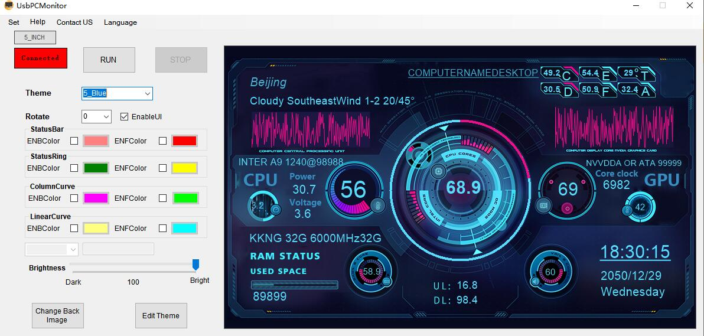

#  turing-smart-screen-python

### ⚠️ DISCLAIMER - PLEASE READ ⚠️

This project is **not affiliated, associated, authorized, endorsed by, or in any way officially connected with Turing or XuanFang brands**, or any of its subsidiaries, affiliates, manufacturers or sellers of the Turing or XuanFang products. All product and company names are the registered trademarks of their original owners.

This project is an open-source alternative software, NOT the USBMonitor.exe / ExtendScreen.exe or any original software for the smart screens (even if some themes have been reused). **Please do not open issues for USBMonitor.exe/ExtendScreen.exe here**, instead you can use:
* for Turing Smart Screen, the official forum here: http://discuz.turzx.com/
* for XuanFang Smart screen, contact your reseller
---

     
  

A Python system monitor program and a library for **3.5" & 5" IPS USB-C (UART) displays.**    

Supported operating systems : macOS, Windows, Linux (incl. Raspberry Pi), basically all OS that support Python 3.8+  

### Supported smart screens models:

| Turing Smart Screen 3.5"                             | XuanFang 3.5"                                     | Turing Smart Screen 5"                      |
|------------------------------------------------------|---------------------------------------------------|---------------------------------------------|
|                     |                |        |
| also improperly called "revision A" by the resellers | revision B & flagship (with backplate & RGB LEDs) | basic support (no video or storage for now) |

### [> What is my smart screen model?](https://github.com/mathoudebine/turing-smart-screen-python/wiki/Hardware-revisions)  

**Please note the Turing and the XuanFang screens are different products** designed and produced by different companies, despite having a similar appearance. The communication protocol is also different.  
This project support products from both manufacturers, including backplate RGB LEDs for available models!

If you haven't received your screen yet but want to start developing your theme now, you can use the [**"simulated LCD" mode!**](https://github.com/mathoudebine/turing-smart-screen-python/wiki/Simulated-display)

### Not supported yet or not tested smart screen models:

| _Turing Smart Screen 8.8"_                  | _Turing Smart Screen 2.1"_                  | _[(Fuldho?) 3.5" IPS Screen](https://aliexpress.com/item/1005005632018367.html)_                                          |
|---------------------------------------------|---------------------------------------------|---------------------------------------------------------------------------------------------------------------------------|
|        |       |                                                                                       |
| Not tested, may use the same protocol as 5" | Not tested, may use the same protocol as 5" | Not supported, managed with [proprietary Windows software `SmartMonitor.exe`](https://smartdisplay.lanzouo.com/b04jvavkb) |

| _[SmartCool Lcd](https://aliexpress.com/item/1005005443609423.html) / [GeekTeches AD35](https://aliexpress.com/item/1005004858688084.html) / AIDA64 / AX206_                                     | _[(Unknown manufacturer) UsbPCMonitor 3.5" / 5"](https://aliexpress.com/item/1005003931363455.html)_                                                                                          |
|--------------------------------------------------------------------------------------------------------------------------------------------------------------------------------------------------|-----------------------------------------------------------------------------------------------------------------------------------------------------------------------------------------------|
|    |                                                                                                                                                         |
| Not supported. Produced by multiple manufacturers, all use the same [Appotech AX206 hacked photo frame firmware](https://github.com/dreamlayers/dpf-ax). Supported by AIDA64 and lcd4linux       | Not tested. Visually identical to Turing 3.5" / 5" but managed by [proprietary Windows software `UsbPCMonitor.exe`](https://www.adrive.com/public/rpZfpm/0128200%20USBPCMonitorENG_2_1_4.rar) |

## How to start

### [> Follow instructions on the wiki to configure and start this project.](https://github.com/mathoudebine/turing-smart-screen-python/wiki)

There are 2 possible uses of this project Python code:
* **[as a System Monitor](#system-monitor)**, a standalone program working with themes to display your computer HW info.
[Check if your hardware is supported.](https://github.com/mathoudebine/turing-smart-screen-python/wiki/System-monitor-:-hardware-support)
* **[integrated in your project](#control-the-display-from-your-python-projects)**, to control the display from your own Python code.

## System monitor

This project is mainly a complete standalone program to use your screen as a system monitor, like the original vendor app.  
Some themes are already included for a quick start!  
### [> Configure and start system monitor](https://github.com/mathoudebine/turing-smart-screen-python/wiki/System-monitor-:-how-to-start)

* Fully functional multi-OS code base (operates out of the box, tested on Windows, Linux & MacOS).
* Display configuration using GUI configuration wizard or `config.yaml` file: no Python code to edit.
* Support for [3.5" & 5" smart screen models (Turing and XuanFang)](https://github.com/mathoudebine/turing-smart-screen-python/wiki/Hardware-revisions). Backplate RGB LEDs are also supported for available models!
* Support [multiple hardware sensors and metrics (CPU/GPU usage, temperatures, memory, disks, etc)](https://github.com/mathoudebine/turing-smart-screen-python/wiki/System-monitor-:-themes#stats-entry) with configurable refresh intervals.
* Allow [creation of themes (see `res/themes`) with `theme.yaml` files using theme editor](https://github.com/mathoudebine/turing-smart-screen-python/wiki/System-monitor-:-themes) to be [shared with the community!](https://github.com/mathoudebine/turing-smart-screen-python/discussions/categories/themes)
* Easy to expand: additional code that pulls specific information can be written in a modular way without impacting existing code.
* Auto detect comm port. No longer need to hard set it, or if it changes on you then the config is wrong.
* Tray icon with Exit option, useful when the program is running in background

### [> List and preview of included themes](res/themes/themes.md)
       ... [view full list](res/themes/themes.md)
### [> Themes creation/edition (using theme editor)](https://github.com/mathoudebine/turing-smart-screen-python/wiki/System-monitor-:-themes)
### [> Themes shared by the community](https://github.com/mathoudebine/turing-smart-screen-python/discussions/categories/themes)
 
  and more... Share yours!

## Control the display from your Python projects

If you don't want to use your screen for system monitoring, you can just use this project as a module to do some simple operations on the display from any Python code :
- **Display custom picture**
- **Display text**
- **Display progress bar**
- **Screen rotation**
- Clear the screen (blank)
- Turn the screen on/off
- Display soft reset
- Set brightness
- Set backplate RGB LEDs color (on supported hardware rev.) 

Check `simple-program.py` as an example.

### [> Control the display from your code](https://github.com/mathoudebine/turing-smart-screen-python/wiki/Control-screen-from-your-own-code)

## Troubleshooting
If you have trouble running the program as described in the wiki, please check [open/closed issues](https://github.com/mathoudebine/turing-smart-screen-python/issues) & [the wiki Troubleshooting page](https://github.com/mathoudebine/turing-smart-screen-python/wiki/Troubleshooting)

## Star History

