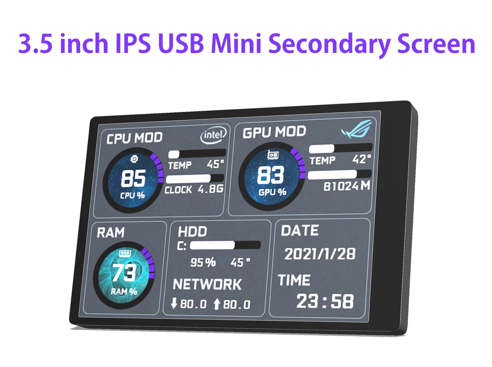
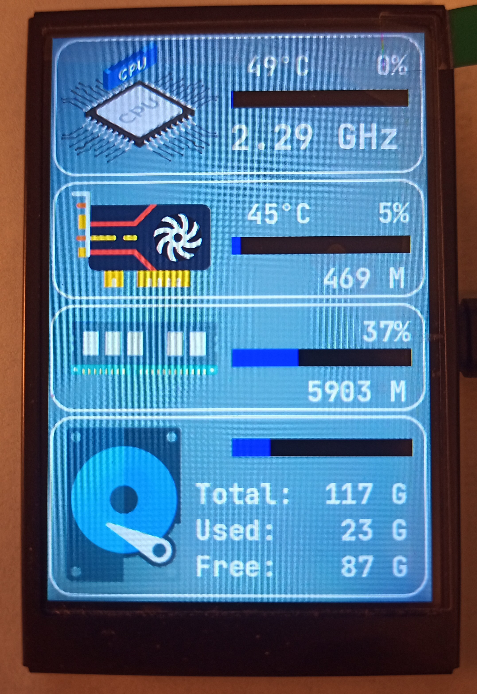
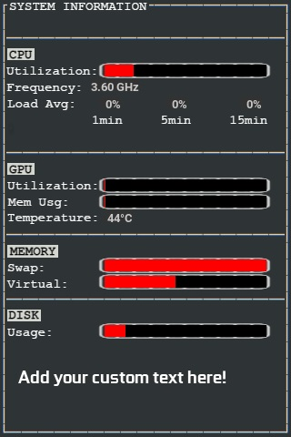
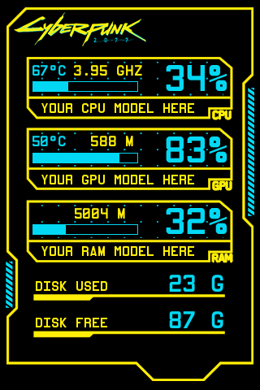
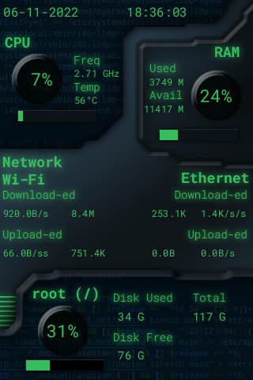
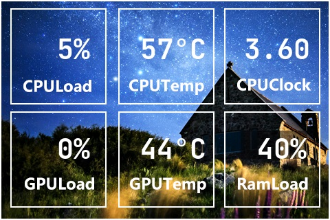

# turing-smart-screen-python

### ⚠️ DISCLAIMER - PLEASE READ ⚠️

This project is **not affiliated, associated, authorized, endorsed by, or in any way officially connected with Turing brand**, or any of its subsidiaries, affiliates, manufacturers or sellers of the Turing products. All product and company names are the registered trademarks of their original owners.

This project is an open-source alternative software, not the USBMonitor.exe original software for the Turing smart screen. There will be no support for the USBMonitor.exe software.

---

A Python system monitor program and a library for "Turing Smart Screen" 3.5" IPS USB-C (UART) display, also known as :
- Turing USB35INCHIPS / USB35INCHIPSV2 (revision A)
- XuanFang display (revision B & flagship)
- [3.5 Inch 320*480 Mini Capacitive Touch Screen IPS Module](https://www.aliexpress.com/item/1005003723773653.html)

[**Display hardware revisions supported: A, B & flagship**](https://github.com/mathoudebine/turing-smart-screen-python/wiki/Hardware-revisions).  
Flagship backplate RGB LEDs are also supported!  
If you haven't received your screen yet but want to start developing your theme now, you can use the [**"simulated LCD" mode!**](https://github.com/mathoudebine/turing-smart-screen-python/wiki/Simulated-display)

Operating systems supported : macOS, Windows, Linux (incl. Raspberry Pi) and all OS that support Python 3.x

## How to use

### [> Follow instructions on the wiki to configure and start this project.](https://github.com/mathoudebine/turing-smart-screen-python/wiki)

There are 2 possible uses of this project Python code:
* **[as a System Monitor](#system-monitor)**, a standalone program working with themes to display your computer HW info.
[Check if your hardware is supported.](https://github.com/mathoudebine/turing-smart-screen-python/wiki/System-monitor-:-hardware-support)
* **[integrated in your project](#control-the-display-from-your-python-projects)**, to control the display from your own Python code.

## System monitor

This project is mainly a complete standalone program to use your screen as a system monitor, like the original vendor app.  
Some themes are already included for a quick start!
### [> Configure and start system monitor](https://github.com/mathoudebine/turing-smart-screen-python/wiki/System-monitor-:-how-to-start)
* Fully functional multi-OS code base (operates out of the box, tested on Windows, Linux & MacOS).
* Display configuration using `config.yaml` file: no Python code to edit.
* Support for all [3 screen HW revisions: A, B & flagship](https://github.com/mathoudebine/turing-smart-screen-python/wiki/Hardware-revisions). Flagship backplate RGB LEDs are also supported!
* Support [multiple hardware sensors and metrics (CPU/GPU usage, temperatures, memory, disks, etc)](https://github.com/mathoudebine/turing-smart-screen-python/wiki/System-monitor-:-themes#stats-entry) with configurable refresh intervals.
* Allow [creation of themes (see `res/themes`) with `theme.yaml` files](https://github.com/mathoudebine/turing-smart-screen-python/wiki/System-monitor-:-themes) to be shared with the community!
* Easy to expand: additional code that pulls specific information can be written in a modular way without impacting existing code.
* Auto detect comm port. No longer need to hard set it, or if it changes on you then the config is wrong.

Screenshots from the latest version using included themes:  
    

### [> Themes creation/edition](https://github.com/mathoudebine/turing-smart-screen-python/wiki/System-monitor-:-themes)

## Control the display from your Python projects

If you don't want to use your screen for system monitoring, you can just use this project as a module to do some simple operations on the display from any Python code :
- **Display custom picture**
- **Display text**
- **Display progress bar**
- **Screen rotation**
- Clear the screen (blank)
- Turn the screen on/off
- Display soft reset
- Set brightness
- Set backplate RGB LEDs color (on supported hardware rev.) 

Check `simple-program.py` as an example.

### [> Control the display from your code](https://github.com/mathoudebine/turing-smart-screen-python/wiki/Control-screen-from-your-own-code)

## Troubleshooting
If you have trouble running the program as described in the wiki, please check [open/closed issues](https://github.com/mathoudebine/turing-smart-screen-python/issues) & [the wiki Troubleshooting page](https://github.com/mathoudebine/turing-smart-screen-python/wiki/Troubleshooting)

