#  turing-smart-screen-python

### ⚠️ DISCLAIMER - PLEASE READ ⚠️

This project is **not affiliated, associated, authorized, endorsed by, or in any way officially connected with Turing / XuanFang / Kipye brands**, or any of theirs subsidiaries, affiliates, manufacturers or sellers of their products. All product and company names are the registered trademarks of their original owners.

This project is an open-source alternative software, NOT the original software provided for the smart screens. **Please do not open issues for USBMonitor.exe/ExtendScreen.exe or for the smart screens hardware here**.
* for Turing Smart Screen, use the official forum here: http://discuz.turzx.com/
* for other smart screens, contact your reseller
---

     
  

A Python system monitor program and an abstraction library for **small IPS USB-C (UART) displays.**    

Supported operating systems : macOS, Windows, Linux (incl. Raspberry Pi), basically all OS that support Python 3.8+  

### Supported smart screens models:

| ✅ Turing Smart Screen 3.5"                           | ✅ XuanFang 3.5"                                   | ✅ Turing Smart Screen 5"                    |
|------------------------------------------------------|---------------------------------------------------|---------------------------------------------|
| 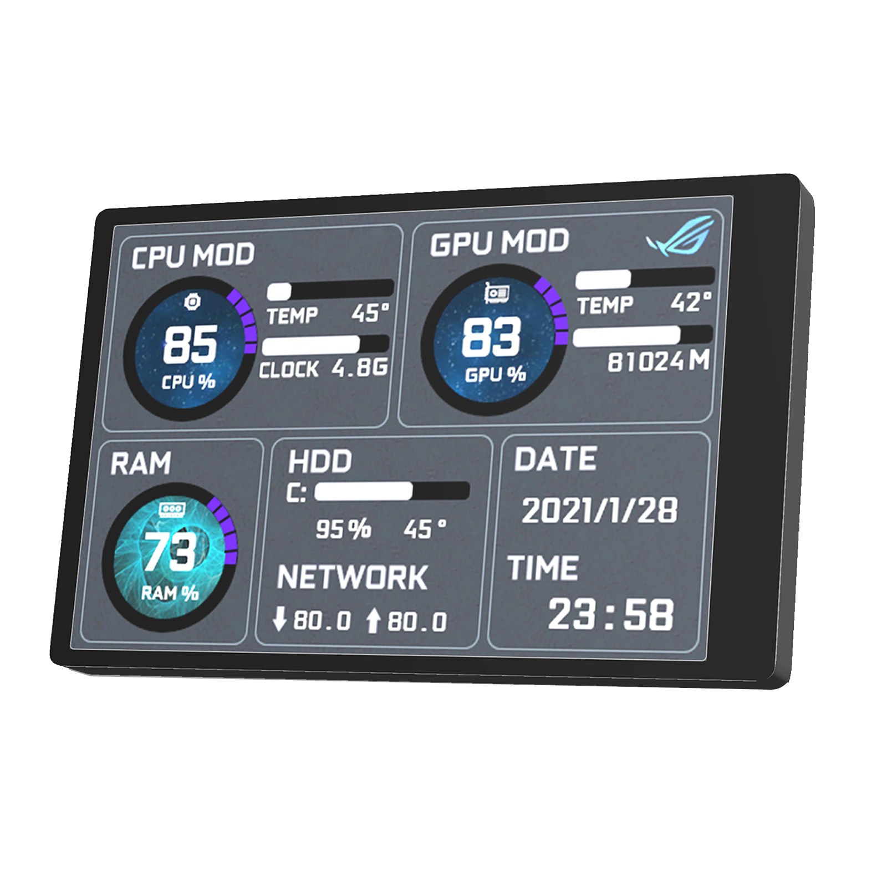                    | 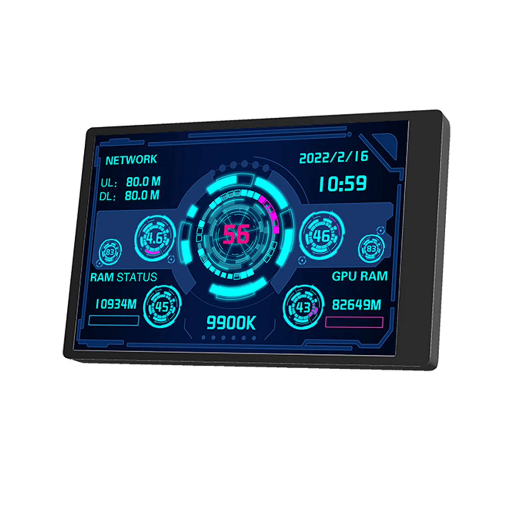               | 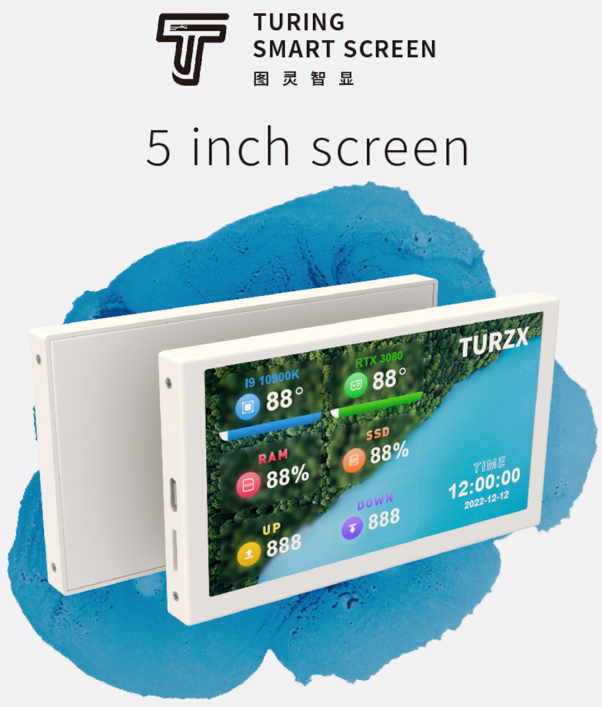       |
| also improperly called "revision A" by the resellers | revision B & flagship (with backplate & RGB LEDs) | basic support (no video or storage for now) |

| ✅ [UsbPCMonitor 3.5" / 5"](https://aliexpress.com/item/1005003931363455.html)                       | ✅ [Kipye Qiye Smart Display 3.5"](https://www.aliexpress.us/item/3256803899049957.html) |
|-----------------------------------------------------------------------------------------------------|-----------------------------------------------------------------------------------------|
| 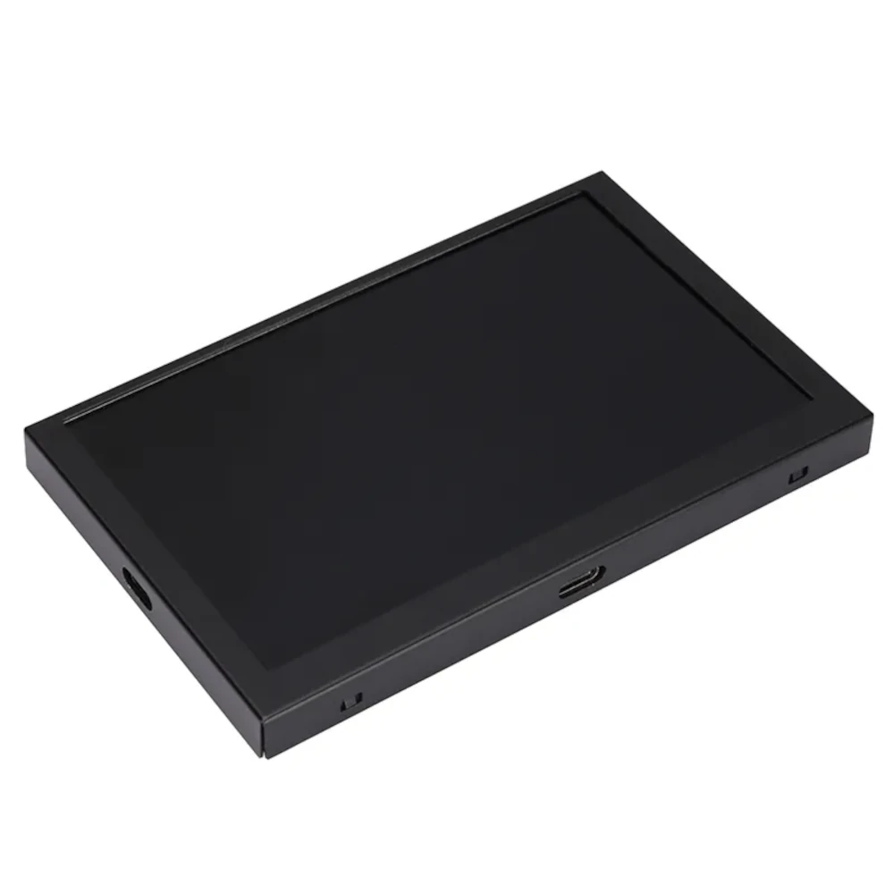                              | 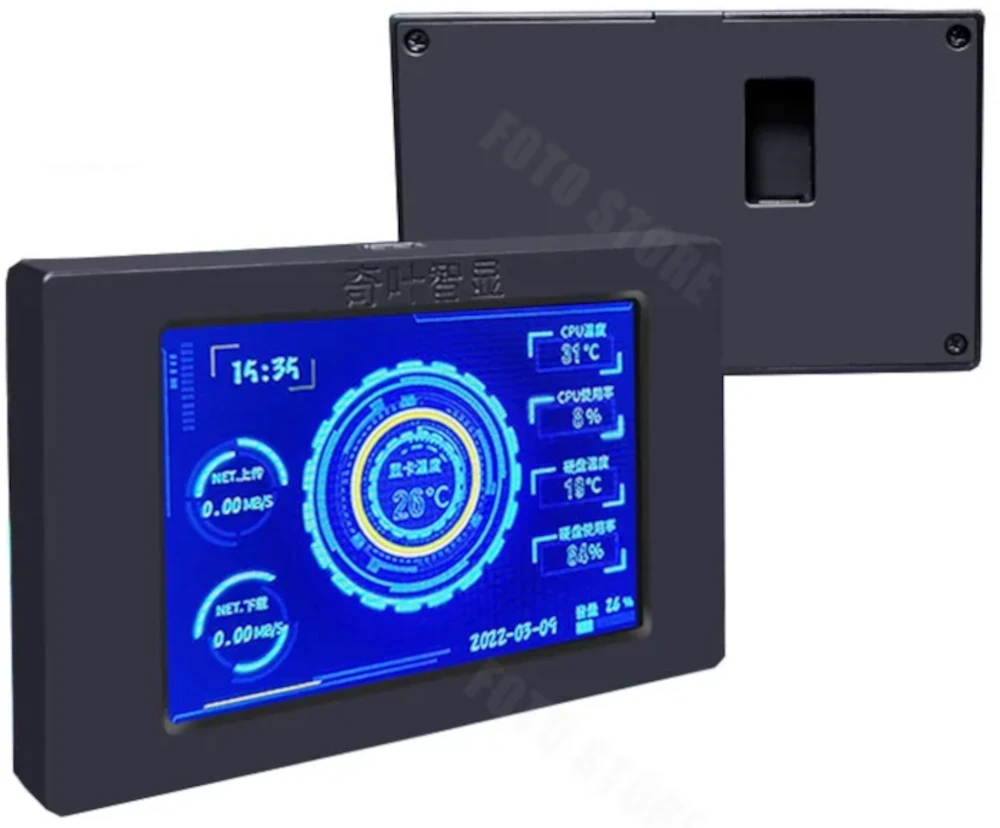                       |
| Unknown manufacturer, visually similar to Turing 3.5" / 5". Original software is `UsbPCMonitor.exe` | Front panel has an engraved inscription "奇叶智显" Qiye Zhixian (Qiye Smart Display)        |

### [> What is my smart screen model?](https://github.com/mathoudebine/turing-smart-screen-python/wiki/Hardware-revisions)  

**Please note all listed smart screens are different products** designed and produced by different companies, despite having a similar appearance. Their communication protocol is also different.  
This project offers an abstraction layer to manage all of these products in a unified way, including some product-specific features like backplate RGB LEDs for available models!

If you haven't received your screen yet but want to start developing your theme now, you can use the [**"simulated LCD" mode!**](https://github.com/mathoudebine/turing-smart-screen-python/wiki/Simulated-display)

### Not (yet) supported / not tested smart screen models:

| ❔ _Turing Smart Screen 8.8"_                                                                                                                     | ❔ _Turing Smart Screen 2.1"_                                                                                                                     | ❌ _[(Fuldho?) 3.5" IPS Screen](https://aliexpress.com/item/1005005632018367.html)_                                                                                                                                                                                                                  |
|--------------------------------------------------------------------------------------------------------------------------------------------------|--------------------------------------------------------------------------------------------------------------------------------------------------|-----------------------------------------------------------------------------------------------------------------------------------------------------------------------------------------------------------------------------------------------------------------------------------------------------|
| 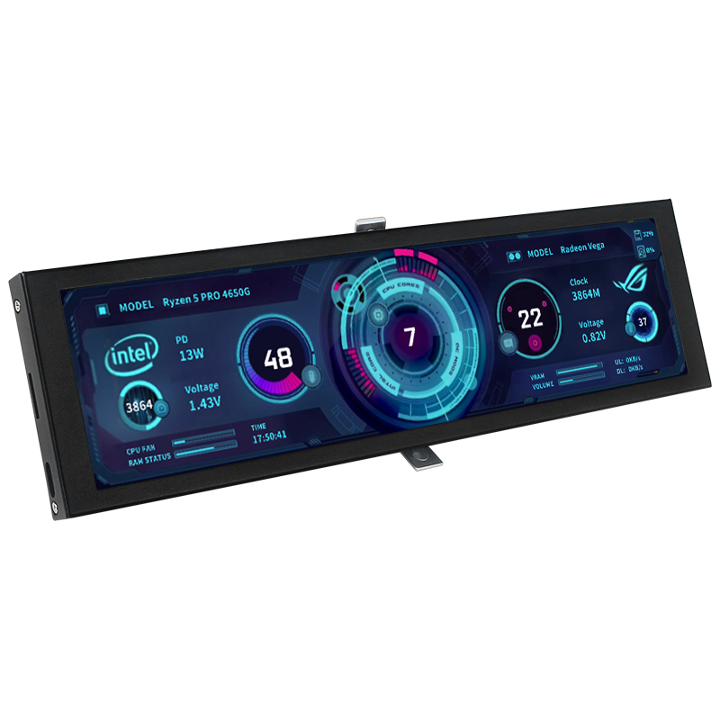                                                                                                            | 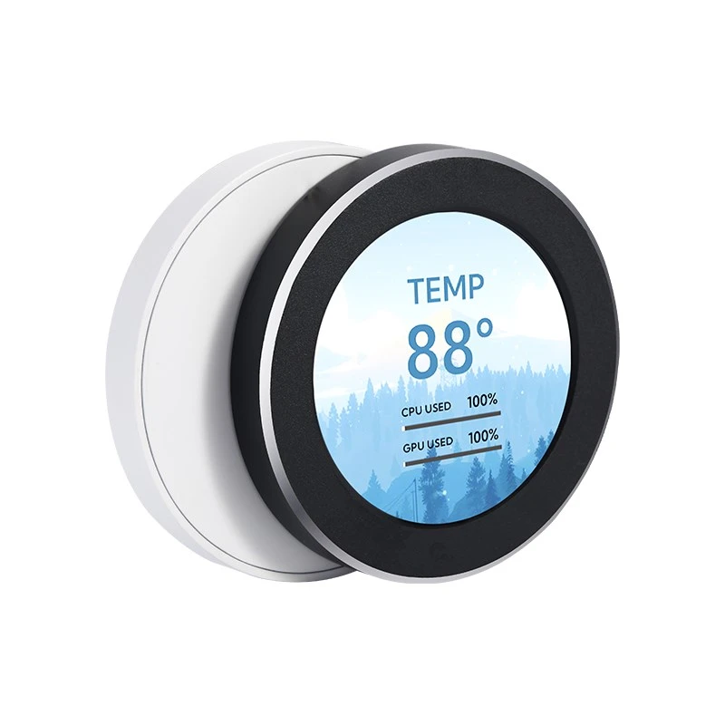                                                                                                           | 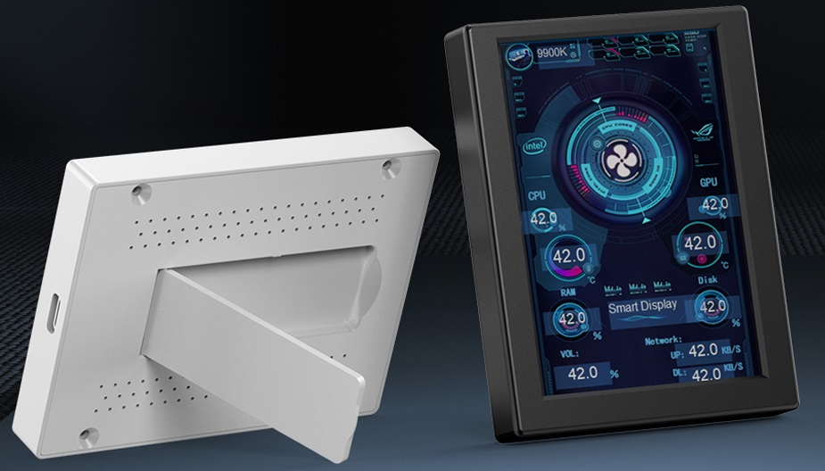                                                                                                                                                                                                                                                                |
| Very similar protocol than the 5". [Support planned in a future version.](https://github.com/mathoudebine/turing-smart-screen-python/issues/264) | Very similar protocol than the 5". [Support planned in a future version.](https://github.com/mathoudebine/turing-smart-screen-python/issues/264) | Managed with [proprietary Windows software `SmartMonitor.exe`](https://smartdisplay.lanzouo.com/b04jvavkb). Cannot be supported by this project: [see here](https://github.com/mathoudebine/turing-smart-screen-python/discussions/298). Use alternative library https://github.com/braewoods/hidss |

| ❔ _Waveshare [2.1inch](https://www.waveshare.com/wiki/2.1inch-USB-Monitor) / [2.8inch](https://www.waveshare.com/wiki/2.8inch-USB-Monitor) / [5inch](https://www.waveshare.com/wiki/5inch-USB-Monitor) / [7inch](https://www.waveshare.com/wiki/7inch-USB-Monitor) USB-Monitor_ | ❔ _[GUITION Smart screen](https://aliexpress.com/item/1005006169962183.html)_ |
|---------------------------------------------------------------------------------------------------------------------------------------------------------------------------------------------------------------------------------------------------------------------------------|-------------------------------------------------------------------------------|
| 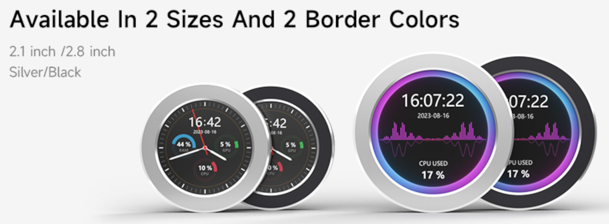                                                                                                                                                                                                                               | 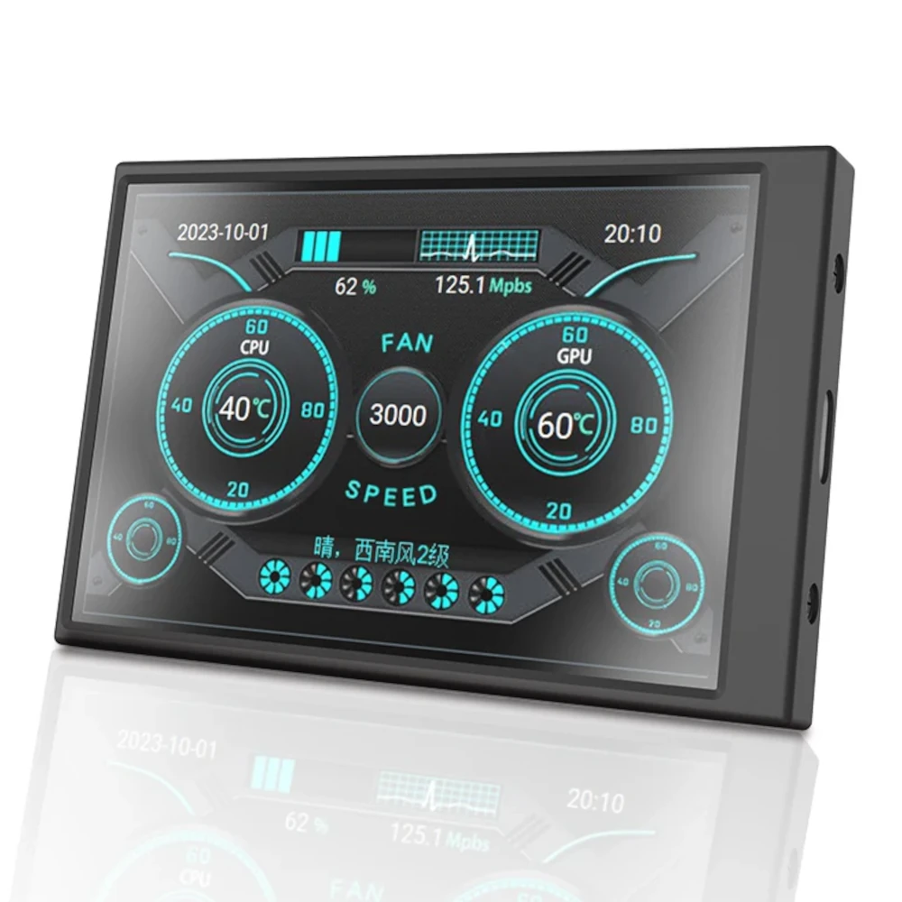                                            |
| Not tested.  Sold on [Waveshare shop](https://www.waveshare.com/2.8inch-usb-monitor.htm) or [Aliexpress](https://fr.aliexpress.com/item/1005006071685067.html). 5inch / 7inch models not sold for now. Supported by Waveshare PC Monitor.                                       | Not tested. Provided with "GUITION Smart screen" software                     |

| ❔ _[SmartCool Lcd](https://aliexpress.com/item/1005005443609423.html) / [GeekTeches AD35](https://aliexpress.com/item/1005004858688084.html) / AIDA64 / AX206_                                   |
|--------------------------------------------------------------------------------------------------------------------------------------------------------------------------------------------------|
| 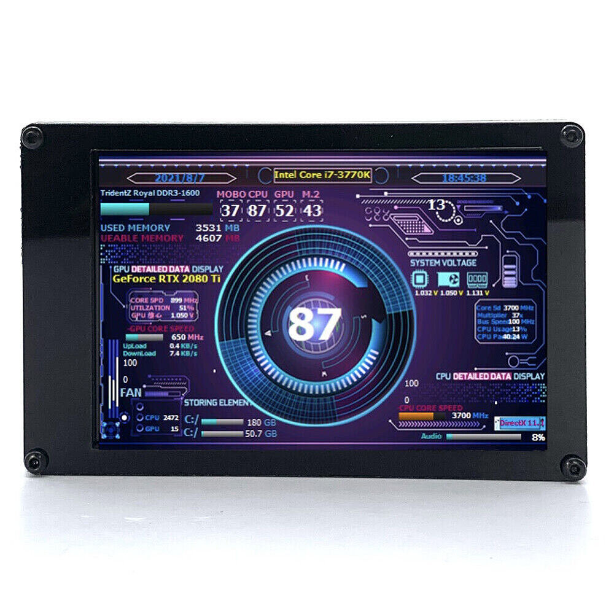 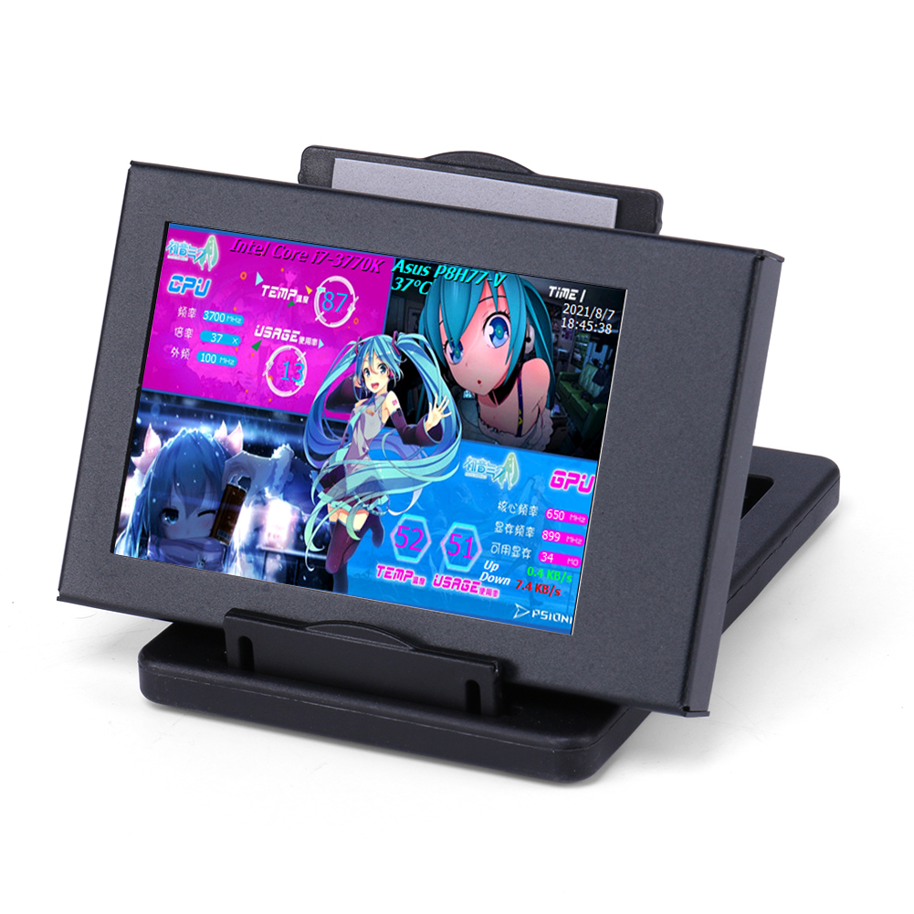 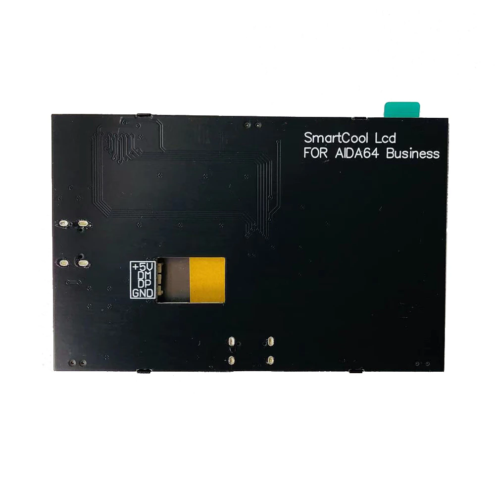 |
| Not supported. Produced by multiple manufacturers, all use the same [Appotech AX206 hacked photo frame firmware](https://github.com/dreamlayers/dpf-ax). Supported by AIDA64 and lcd4linux       |

## How to start

### [> Follow instructions on the wiki to configure and start this project.](https://github.com/mathoudebine/turing-smart-screen-python/wiki)

There are 2 possible uses of this project Python code:
* **[as a System Monitor](#system-monitor)**, a standalone program working with themes to display your computer HW info and custom data in an elegant way.
[Check if your hardware is supported.](https://github.com/mathoudebine/turing-smart-screen-python/wiki/System-monitor-:-hardware-support)
* **[integrated in your project](#control-the-display-from-your-python-projects)**, to fully control the display from your own Python code.

## System monitor

This project is mainly a complete standalone program to use your screen as a system monitor, like the original vendor app.  
Some themes are already included for a quick start!  
### [> Configure and start system monitor](https://github.com/mathoudebine/turing-smart-screen-python/wiki/System-monitor-:-how-to-start)
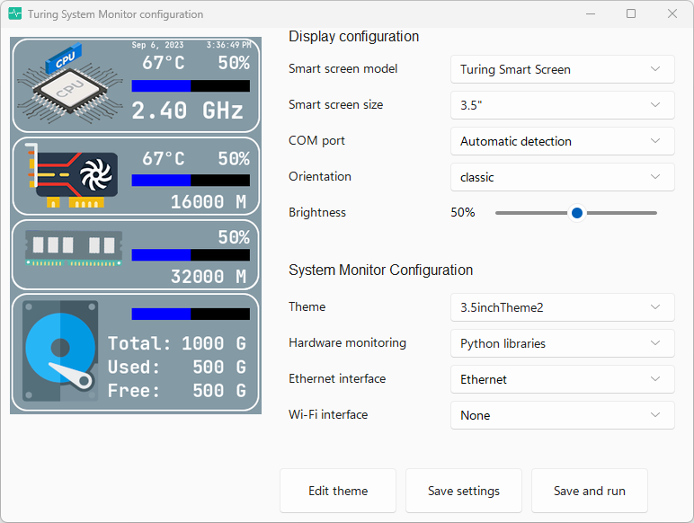  

* Fully functional multi-OS code base (operates out of the box, tested on Windows, Linux & MacOS).
* Display configuration using GUI configuration wizard or `config.yaml` file: no Python code to edit.
* Compatible with [3.5" & 5" smart screen models (Turing, XuanFang...)](https://github.com/mathoudebine/turing-smart-screen-python/wiki/Hardware-revisions). Backplate RGB LEDs are also supported for available models!
* Support [multiple hardware sensors and metrics (CPU/GPU usage, temperatures, memory, disks, etc)](https://github.com/mathoudebine/turing-smart-screen-python/wiki/System-monitor-:-themes#stats-entry) with configurable refresh intervals.
* Allow [creation of themes (see `res/themes`) with `theme.yaml` files using theme editor](https://github.com/mathoudebine/turing-smart-screen-python/wiki/System-monitor-:-themes) to be [shared with the community!](https://github.com/mathoudebine/turing-smart-screen-python/discussions/categories/themes)
* Easy to expand: [custom Python data sources](https://github.com/mathoudebine/turing-smart-screen-python/wiki/System-monitor-:-themes#add-custom-stats-to-a-theme) can be written to pull specific information and display it on themes like any other sensor.
* Auto-detect COM port based on the selected smart screen model.
* Tray icon with Exit option, useful when the program is running in background.

### [> List and preview of included themes](res/themes/themes.md)
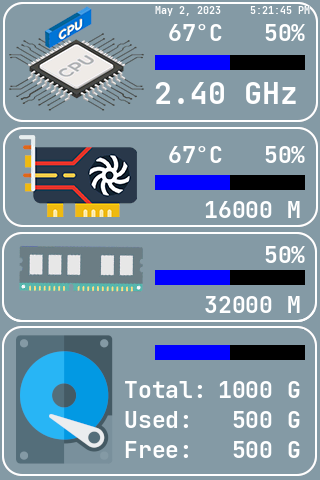 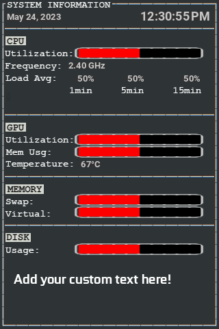  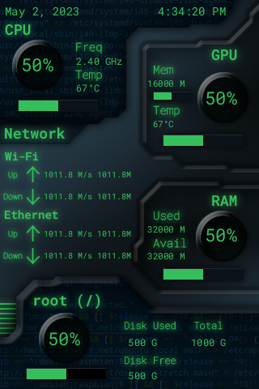 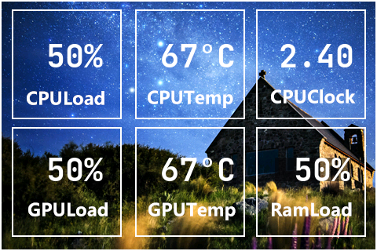 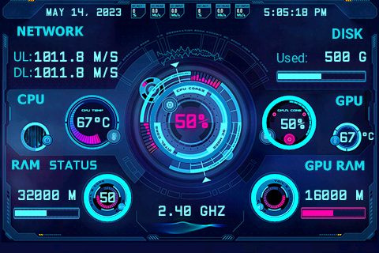 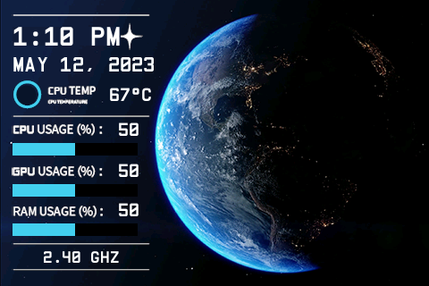 ... [view full list](res/themes/themes.md)
### [> Themes creation/edition (using theme editor)](https://github.com/mathoudebine/turing-smart-screen-python/wiki/System-monitor-:-themes)
### [> Themes shared by the community](https://github.com/mathoudebine/turing-smart-screen-python/discussions/categories/themes)
 
  and more... Share yours!

## Control the display from your Python projects

If you don't want to use your screen for system monitoring, you can just use this project as a module from any Python code to do some simple operations on the display:
- **Display custom picture**
- **Display text**
- **Display horizontal / radial progress bar**
- **Screen rotation**
- Clear the screen (blank)
- Turn the screen on/off
- Display soft reset
- Set brightness
- Set backplate RGB LEDs color (on supported hardware rev.) 

This project will act as an abstraction library to handle specific protocols and capabilities of each supported smart screen models in a transparent way for the user.
Check `simple-program.py` as an example.

### [> Control the display from your code](https://github.com/mathoudebine/turing-smart-screen-python/wiki/Control-screen-from-your-own-code)

## Troubleshooting
If you have trouble running the program as described in the wiki, please check [open/closed issues](https://github.com/mathoudebine/turing-smart-screen-python/issues) & [the wiki Troubleshooting page](https://github.com/mathoudebine/turing-smart-screen-python/wiki/Troubleshooting)

## They're talking about it!

* [Hackaday - Cheap LCD Uses USB Serial](https://hackaday.com/2023/09/11/cheap-lcd-uses-usb-serial/)  

* [CNX Software - Turing Smart Screen – A low-cost 3.5-inch USB Type-C information display](https://www.cnx-software.com/2022/04/29/turing-smart-screen-a-low-cost-3-5-inch-usb-type-c-information-display/)

* [Phazer Tech - Turing Smart Screen Python ](https://phazertech.com/tutorials/turing-smart-screen.html)

## Star History

