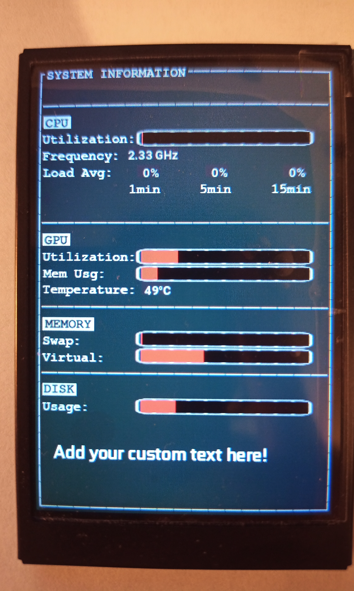

# turing-smart-screen-python

| Check out new version with system monitoring features!                                                                                                                                                                                                                                                                                                                                                                                                                                                                                                                                                                                             |
|----------------------------------------------------------------------------------------------------------------------------------------------------------------------------------------------------------------------------------------------------------------------------------------------------------------------------------------------------------------------------------------------------------------------------------------------------------------------------------------------------------------------------------------------------------------------------------------------------------------------------------------------------|
| Are you using your Turing Smart Screen for system monitoring?   If so, check out the new [**pre-release 2.0.0 beta 1 - 📊 System Monitor**](https://github.com/mathoudebine/turing-smart-screen-python/releases/tag/2.0.0-beta.1) or the `feature/system-monitoring` branch!        It contains embedded hardware monitoring functions, theme creation from configuration files, serial port auto-detection...   See Release Notes to learn more about features and current limitations  _Python knowledges recommended._  |

---

### ⚠️ DISCLAIMER - PLEASE READ ⚠️

This project is **not affiliated, associated, authorized, endorsed by, or in any way officially connected with Turing brand**, or any of its subsidiaries, affiliates, manufacturers or sellers of the Turing products. All product and company names are the registered trademarks of their original owners.

This project is an open-source alternative software, not the USBMonitor.exe original software for the Turing smart screen. There will be no support for the USBMonitor.exe software.

---

A simple Python manager for "Turing Smart Screen" 3.5" IPS USB-C (UART) display, also known as :
- Turing USB35INCHIPS / USB35INCHIPSV2 (revision A)
- XuanFang display (revision B & flagship)
- [3.5 Inch 320*480 Mini Capacitive Touch Screen IPS Module](https://www.aliexpress.com/item/1005003723773653.html)

## Hardware

The Turing Smart Screen is a 3.5" USB-C display that shows as a serial port once connected.
It cannot be seen by the operating system as a monitor but pictures can be displayed on it.

There is 3 hardware revisions of the screen: [how to identify my version?](https://github.com/mathoudebine/turing-smart-screen-python/wiki/Hardware-revisions) Version B and "flagship" use the same protocol.  
A [Windows-only software is available](https://github.com/mathoudebine/turing-smart-screen-python/wiki/Vendor-apps) is provided by the vendor to manage this display.
This software allows creating themes to display your computer sensors on the screen, but does not offer a simple way to display custom pictures or text.

## Features
This Python script can do some simple operations on the Turing display like :
- **Display custom picture**
- **Display text**
- **Display progress bar**
- **Screen rotation**
- Clear the screen (blank) - HW version A only
- Turn the screen on/off - HW version A only
- Display soft reset - HW version A only
- Set brightness

Operating systems supported : macOS, Windows, Linux (incl. Raspberry Pi) and all OS that support Python3.7

## Getting started
_Python knowledges recommended._  
Download this project by cloning it or using the [Releases sections](https://github.com/mathoudebine/turing-smart-screen-python/releases)   
Download and install the latest Python 3.x (min. 3.7) for your OS: https://www.python.org/downloads/  
Plug your Turing display to your computer (install the drivers if on Windows)  
[Identify your hardware revision (version A or version B/flagship)](https://github.com/mathoudebine/turing-smart-screen-python/wiki/Hardware-revisions)  
Open the `mainVersionA.py` or `mainVersionB.py` file and edit the [`COM_PORT`](https://github.com/mathoudebine/turing-smart-screen-python/blob/deb0a60b772f2c5acef377f13b959632ca649f9f/main.py#L15)  variable to the port used by the display  
Open a terminal and run `python3 mainVersionA.py / mainVersionB.py` or `py -3 mainVersionA.py / mainVersionB.py` depending on your OS  
You should see animated content on your Turing display!  

You can then edit the `mainVersionA.py / mainVersionB.py` file to change the content displayed, or use this file as a Python module for your personal Python project
